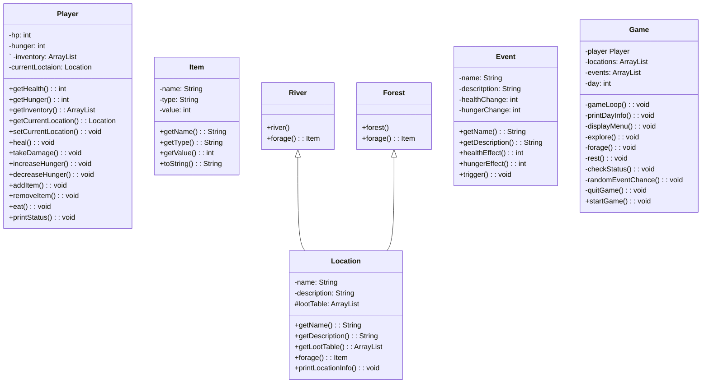

Text-Based Survival Game
Nicholas Cooper
CS121

###Purpose
This project is intended to demonstrate mastery of concepts learned in CS121, specifically Java Object-Oriented programming, use of abstract data types, and use of data structures.

###Overview
This survival game demonstrates java concepts such as classes, inheritance, encapsulation, and abstraction. Using
classes to streamline the process and create an easier process allows for better code. The goal of managing the
health, hunger, and inventory is percefectly suited for this style of programming

###classes
The player class will be used to keep track of the survival mechanics of hunger, hp, location, and inventory. The loaction and inventory will be array list. Methods will allow items to be added or removed from the inventory. Next, the item class will be used as a data class. Similarly, the location class will also be a data class with a few methods for convenience. The event class is the same as the location class i.e. will be a data class with a few methods for convenience. Finally, the game class will handle the core loop of the game (menus, quitting, foraging, etc.).

###Intended User
The project is intended to be used by those who wish to experience a simple text based java oriented surviavl game.

###Use of Object-Oriented Programming Paradigms
Inheritance - River and Forest inherit Location
Polymorphism = River and Forest have different attributes but derive from Location
Encapsulation - Game class
Aggregation  - locations, events, inventory, lootTable
Composition - player, currentLocation
 
###GUI Example

What would you like to do?\
1)Explore\
2)Forage\
3)Rest\
4)Check Status\
5)Eat\
6)Quit\

1

You explore and find a forest what would you like to do?
1)Explore
2)Forage
3)Rest
4)Check Status
5)Eat
6)Quit

2

You found a berry! Added berry to your inventory.
What would you like to do?
1)Explore
2)forage
3)rest
4)check status
5)Eat
6)Quit

3

You rested and healed 3 hp and increased 2 hunger.
What would you like to do?
1)explore
2)forage
3)rest
4)check status
5)eat
6)quit

4

You have 9/10 hp and 5/10 hunger.
You are currently at the forest.
Inventory: berry
what would you like to do?
1)explore
2)forage
3)rest
4)check status
5)eat
6)quit

5

Inventory: berry
What do you want to eat

berry

Your hunger decreased by 2
What do you want to do?
1)explore
2)forage
3)rest
4)check status
5)eat
6)quit

6

Thanks for playing

###Milestones

-UML approval
-Item
-Location
-River
-Forest
-Player
-Event
-Game

