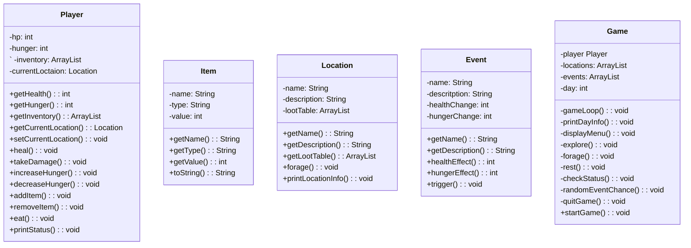

Survival Game
Nicholas Cooper
CS121

###Purpose
This project is intended to demonstrate mastery of concepts learned in CS121, specifically Java Object-Oriented programming, use of abstract data types, and use of data structures.

###Overview
This survival game demonstrates java concepts such as classes, inheritance, encapsulation, and abstraction. Using
classes to streamline the process and create an easier process allows for better code. The goal of managing the
health, stamina, hunger, and thirst is percefectly suited for this style of programming

###classes
 

#Player
=============

============

    
